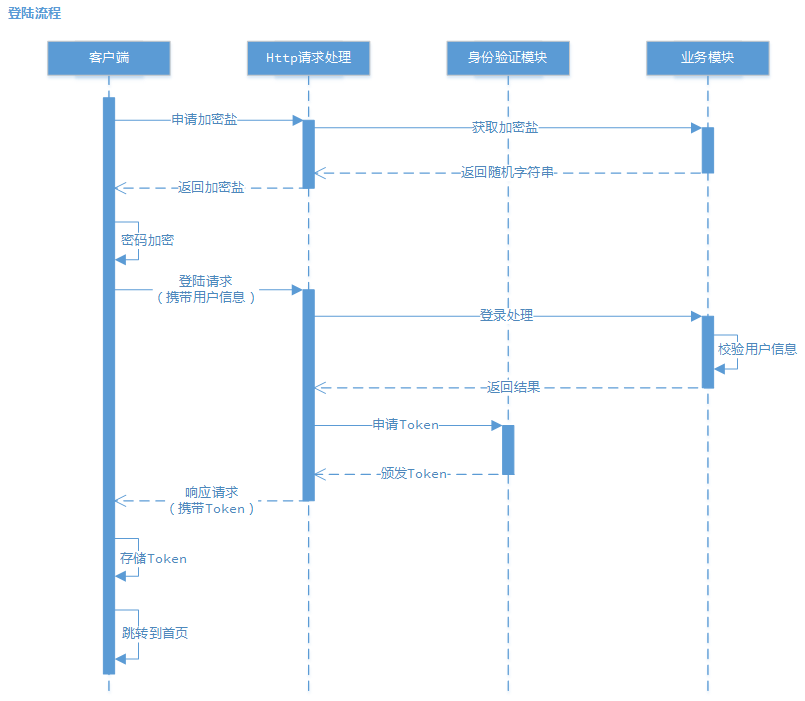
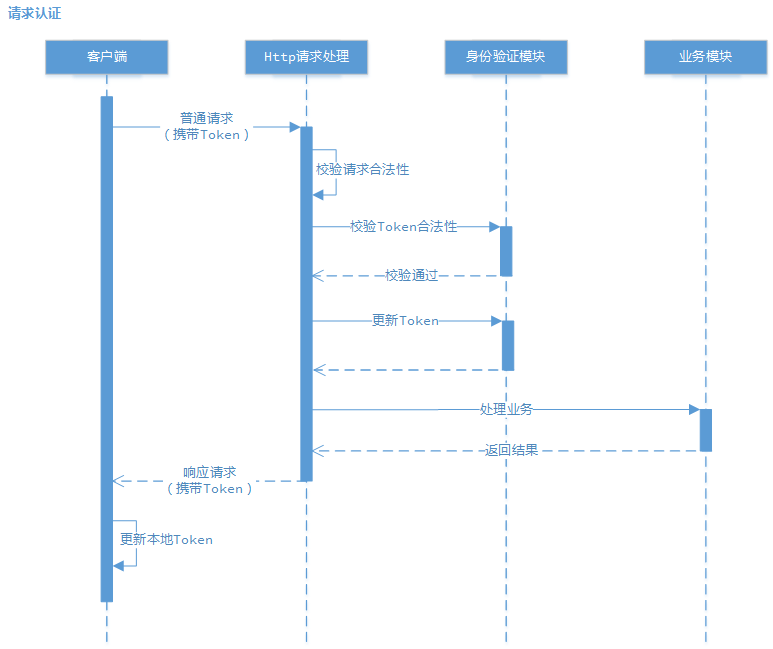
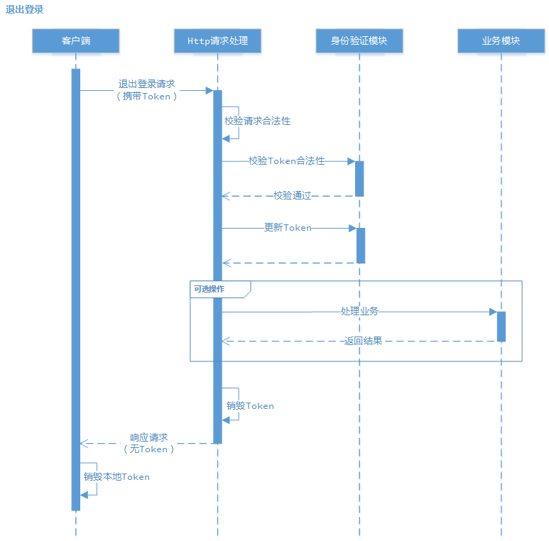

## 一些说明

> 用户名随意，测试密码：空

## 目录
#### &sect; 验证流程
 * [登陆流程](#登陆流程)
 * [请求认证](#请求认证)
 * [退出登陆](#退出登陆)

#### &sect; 身份验证模块
 * [文件构成](#文件构成)
 * [方法说明](#方法说明)

#### &sect; 加密算法
 * [密码加密](#密码加密)
 * [Token加密](#Token加密)

#### &sect; [参考资料](#参考资料)

****

## &sect; 验证流程

 * ### <a name="登陆流程">登陆流程</a>



****

 * ### <a name="请求认证">请求认证</a>



****

 * ### <a name="退出登陆">退出登陆</a>



****

## &sect; 身份验证模块

 * ### <a name="文件构成">文件构成</a>

```
.
├──Server/
│  ├──Common/
   │  ├── Authorization/
      │   ├── IToken.cs
          ├── JwtToken.cs
          ├── JwtAuth.cs
          ├── TokenConfig.cs
          ├── Exceptions.cs
```

 * ### <a name="方法说明">方法说明</a>

> 懒得写了，详见IToken.cs

****

## &sect; 加密算法

 * ### <a name="密码加密">密码加密</a>

> 数据库存储格式：MD5( [原始密码] )

> 前端加密格式：MD5( MD5( [原始密码] ).[服务端随机串] )，用于登陆时传入后端

> 后端校验：[前端加密密码] == MD5( [数据库存储密码].[服务端随机串] )

> 【注意】：MD5和SHA-1被认为不再安全，微软推荐使用SHA-2系列（SHA-256、SHA-512等）加密算法（
<https://msdn.microsoft.com/zh-cn/library/92f9ye3s(v=vs.110).aspx>）

 * ### <a name="Token加密">Token加密</a>

> Token对象构成：

```csharp
    public class JwtToken : IToken
    {
        #region 服务端存储的信息，对客户端隐藏

        public 随机加密盐 Salt { get; set; }
        ...

        #endregion

        #region 提供给客户端的信息

        public 头部 Header { get; set; }
        public 载荷 Payload { get; set; }

        #endregion
    }
```

> Token加密串：Base64Url( [Header] ).Base64Url( [Payload] ).Base64Url( HMAC( Base64Url( [Header] ).Base64Url( [Payload] ) , [Salt] ) )

## &sect; <a name="参考资料">参考资料</a>

 * [Token和JWT](https://ninghao.net/blog/2834)

 * [Http协议](http://www.cnblogs.com/ranyonsue/p/5984001.html)

 * [跨域资源共享(CORS)](http://www.ruanyifeng.com/blog/2016/04/cors.html)
